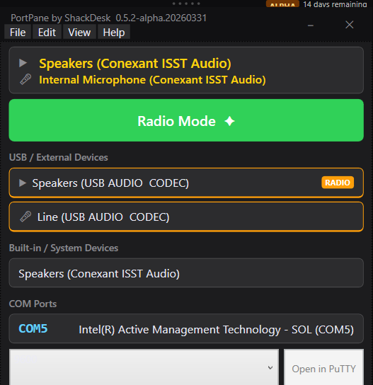

# PortPane by ShackDesk

> **Takes the pain out of ports**

<!-- Logo / banner placeholder — add docs/assets/banner.png when available -->

PortPane is a compact, always-on-top Windows desktop utility for amateur radio operators.
When you plug in a USB radio interface, PortPane instantly shows you which audio devices and
COM ports Windows assigned — so you can configure your digital mode software without opening
Device Manager.

[](https://github.com/Computer-Tsu/shackdesk-portpane/actions/workflows/build.yml)
[](https://github.com/Computer-Tsu/shackdesk-portpane/actions/workflows/build.yml)
[](https://github.com/Computer-Tsu/shackdesk-portpane/releases)
[](https://github.com/Computer-Tsu/shackdesk-portpane/releases/latest)
[](LICENSE-MIT.md)
[](https://github.com/Computer-Tsu/shackdesk-portpane/commits/main)
[](https://github.com/Computer-Tsu/shackdesk-portpane)
[](https://dotnet.microsoft.com/download/dotnet/8.0)
[](https://github.com/Computer-Tsu/shackdesk-portpane)

---

## Screenshot



---

## Download

| Channel | Link | Notes |
| --- | --- | --- |
| **Alpha** | [Latest Alpha release](https://github.com/Computer-Tsu/shackdesk-portpane/releases/tag/latest-alpha) | Updated on every `dev` push. 14-day expiry. For testers. |
| **Stable** | [Latest stable release](https://github.com/Computer-Tsu/shackdesk-portpane/releases/latest) | No stable release yet — coming soon. |

Download `PortPane.exe`. Run it directly. No installation required.

> **Windows SmartScreen note:** PortPane is currently unsigned (code signing certificate pending).
> If SmartScreen blocks it, click "More info" → "Run anyway." This is expected for unsigned utilities.
> Verify the SHA-256 hash posted with each release.

---

## Quick Start

1. Download `PortPane.exe` from Releases
2. Run it (no install, no admin rights needed)
3. Plug in your USB radio interface — PortPane updates instantly

---

## Who Is This For?

**Primary audience:** Amateur radio operators running digital modes on Windows.

**Secondary audience:** IoT hobbyists (Arduino, Raspberry Pi), IT professionals using USB serial
adapters for console access.

Design philosophy: optimized for non-technical older ham radio operators.
Clarity and simplicity take precedence over feature density.

---

## Features

- Instantly shows COM port name and friendly device name when USB device connects
- Lists audio playback and capture devices, grouped as USB/External vs Built-in
- **One-click audio profile switching** — toggle between PC audio and radio CODEC with one button
- Identifies known radio interfaces by VID/PID (SignaLink, DigiRig, RIGblaster, IC-7300, etc.)
- Radio interfaces are badged and highlighted
- USB hotplug detection — updates the device list within 2 seconds of plug/unplug
- Copy COM port name to clipboard with one click
- Ghost port detection — shows disconnected ports grayed out with removal instructions
- Baud rate selector with device-type heuristic suggestions
- PuTTY integration — launch PuTTY pre-configured for selected COM port and baud rate
- Always-on-top window — stays visible while configuring other software
- Hidden chrome — clean UI with menu revealed on click
- Whole-layout scaling (85% – 225%) for high-DPI and accessibility
- Persistent window position and settings
- Portable mode — run from USB drive with settings stored alongside the exe
- Auto-update via Velopack (background, non-interrupting)
- Optional anonymous telemetry (disabled by default)
- MIT licensed — full source available

---

## Supported Digital Mode Software

WSJT-X · Winlink Express · Fldigi · JS8Call · VARA HF · VARA FM · Direwolf · MultiPSK · EasyPAL/SSTV

---

## Recognized USB Radio Hardware

| Device | VID:PID | Type |
| -------- | --------- | ------ |
| Tigertronics SignaLink USB | 08BB:29B0 | Audio |
| DigiRig (Silicon Labs CP2102) | 10C4:EA60 | Serial |
| West Mountain Radio RIGblaster | 0403:6A11 | Audio |
| Icom IC-7300 / IC-705 (CP2108) | 10C4:EA71 | Serial |
| Yaesu SCU-17 | 0839:000A | Serial |
| C-Media CM108 USB Audio | 0D8C:013C | Audio |
| FTDI FT232R | 0403:6001 | Serial |
| QinHeng CH340 | 1A86:7523 | Serial |
| Arduino Uno R3 | 2341:0043 | Serial |

Don't see your device? [Submit a device addition request](.github/ISSUE_TEMPLATE/usb_device_addition.md).

---

## IT Professional Use

PortPane is useful beyond amateur radio:

- Identify which COM port your USB-to-serial adapter claimed
- Launch PuTTY pre-configured for console access (Cisco, Juniper, etc.)
- Baud rate suggestions based on device type (network gear → 9600, Arduino → 115200)

---

## Known Limitations

- **Windows 10 (1809) and Windows 11 only** — intentional. Linux/macOS are not planned.
- **Unsigned binary** — SmartScreen warning expected until code signing is in place.
  Verify SHA-256 hash from the release page.
- Admin rights are never required.

---

## Portable Mode

Place a file named `portable.txt` in the same directory as `PortPane.exe`.
All settings will be stored in `.\PortPane-Data\` relative to the exe.
Ideal for EMCOMM go-kit deployment or running from a USB drive.

---

## Code Signing & Provenance

PortPane release artifacts are currently unsigned. A SignPath-ready code-signing policy and trust model are documented in [CODE_SIGNING_POLICY.md](CODE_SIGNING_POLICY.md).

---

## Building from Source

> The author builds exclusively via GitHub Actions. These instructions are for contributors.

```powershell
dotnet restore
dotnet build
dotnet test
dotnet publish src/PortPane/PortPane.csproj -c Release -r win-x64 --self-contained -p:PublishSingleFile=true -o publish
```

---

## Contributing

See [CONTRIBUTING.md](CONTRIBUTING.md).

Ways to contribute:

- [Bug reports](.github/ISSUE_TEMPLATE/bug_report.md)
- [Feature requests](.github/ISSUE_TEMPLATE/feature_request.md)
- [USB device database additions](.github/ISSUE_TEMPLATE/usb_device_addition.md) — edit `data/usb_devices.json`
- [Translations](TRANSLATING.md)
- Code contributions (CLA required — see [CLA.md](CLA.md))

---

## Translating

See [TRANSLATING.md](TRANSLATING.md). Community translations are always welcome.
Ships with English. German placeholder included. French, Spanish, Japanese stubs planned.

---

## Trademarks

PortPane and ShackDesk are trademarks of My Computer Guru LLC.

Use of the name, branding, or identity in derived products is not permitted without permission.

See [LEGAL.md](LEGAL.md) for trademark notices for Icom, Yaesu, Kenwood, Arduino, SignaLink, DigiRig,
RIGblaster, and other referenced product names.

---

## Support the Author

<!-- GitHub Sponsors / Ko-fi links — to be added when accounts are created -->

If PortPane saves you time, consider leaving a star on GitHub.

---

## License

**Source code license:**

- **MIT** — all source code in this repository is licensed under MIT. See [LICENSE-MIT.md](LICENSE-MIT.md).
- If you compile from this repository yourself, your resulting build is governed by MIT (plus applicable third-party licenses).

**Official ShackDesk build terms:**

- **Commercial terms** may apply to official ShackDesk-distributed binaries, branding/licensing services, and support offerings. See [LICENSE-COMMERCIAL.md](LICENSE-COMMERCIAL.md).
- These official-build terms do **not** limit your MIT rights for source code from this repository.

---

## Attribution

**PortPane** is developed and maintained by **Mark McDow (N4TEK)** of **My Computer Guru LLC**.

Copyright © 2024–2026 Mark McDow. All rights reserved.
